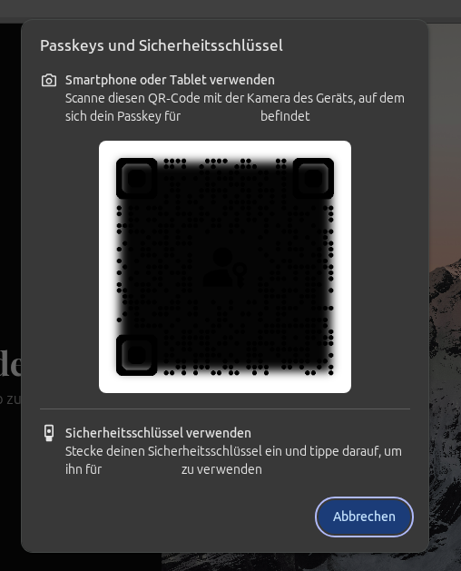
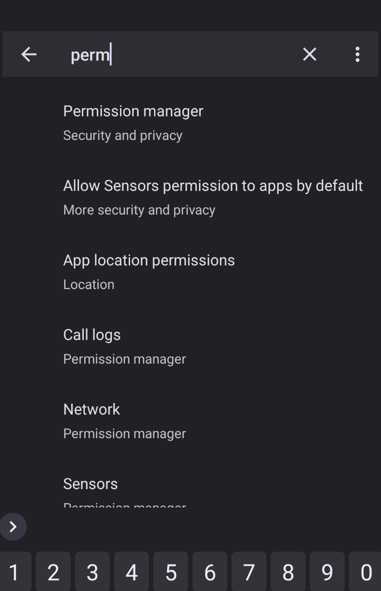
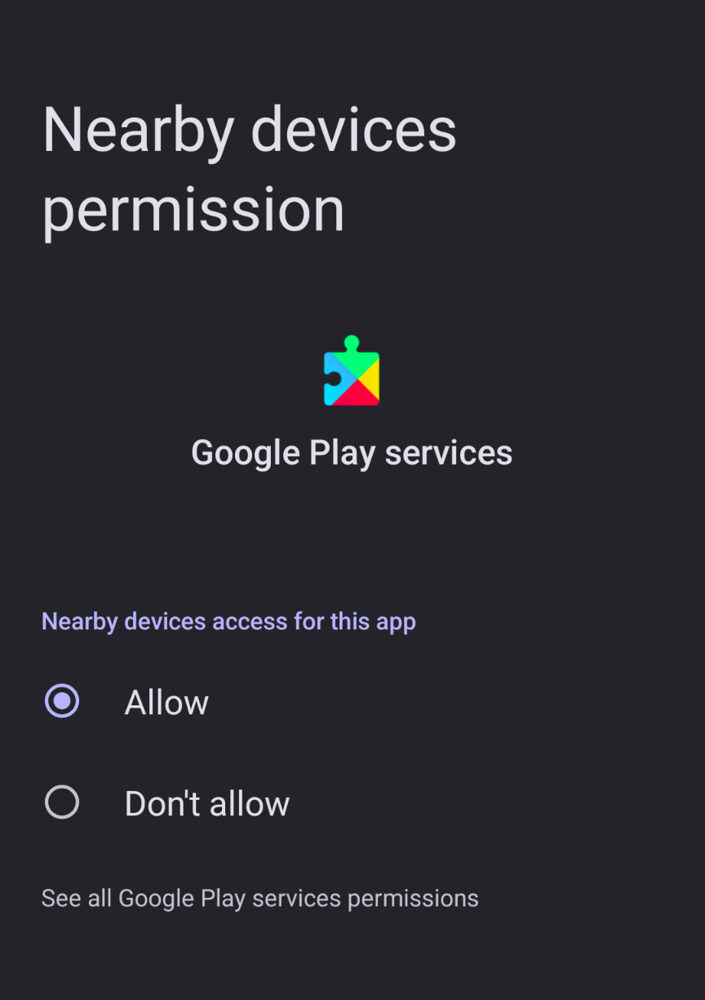

<!--more-->

## Passkeys Are Just Cool

**Passkeys** are honestly one of the coolest things I've been playing around
with recently.

I'm running [**Pocket ID**](https://pocket-id.org) as my own
identity provider, and it has a very nice passkey
implementation - basically **passkey first**.

In my current setup, I'm using a Google Pixel 8a with [**GrapheneOS**](https://grapheneos.org/) as my
custom ROM, and [**Bitwarden**](https://bitwarden.com/) for storing my passkeys (with a self-hosted
[**Vaultwarden**](https://github.com/dani-garcia/vaultwarden) instance behind it). 

___



do not expose your vaultwarden instance directly to the internet, instead host it behind a vpn.


---

## QR Codes are still cool 

Most of my self-hosted services support
OIDC integration, so I can simply put Pocket ID in front of them as my
single sign-on.

Now, here's the problem: when I'm on the go and need access to one of my
apps, I don't always have the Bitwarden browser extension installed. And
to make things harder, I don't have direct access to my vault, since
it's only reachable via VPN for security reasons.

This is exactly where passkeys shine. No more messing with pastebins or
copying passwords from my phone to wherever I need them. 

Instead, Pocket-ID just shows me a QR code. I scan it with my phone, select which
passkey to use, Bitwarden pops up, I verify with my fingerprint - and
I'm logged in. 

**Done**. 

It's brilliant.

---

## Fix the GOS issue

Of course, this doesn't work out of the box for everyone. On stock
Android or iOS, it should work seamlessly. 

But with GrapheneOS I ran into a small issue: a permissions error. 

The fix was simple though. 
I just opened the permissions manager in Settings (easiest way is to
search for it), went to **Nearby Devices**, and allowed Google Play
Services.

After that, the flow is perfect:
1. Open Pocket ID login page.
2. Click *Login*.
3. Wait for the QR code prompt.
4. Scan and approve with fingerprint.
5. Done.

That's it and it feels so smooth. 

# Passkeys really are just cool.