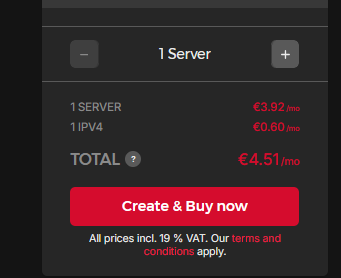

Want to maintain full control over your data?

A few years ago, I turned my back on the big cloud providers and have been handling the provisioning of such services myself ever since. For me, it's all about data sovereignty – my data is my data, and I don't want to "pay" for services with my information.

Google and company may offer free services, but they're not really free – you pay with your (meta)data. I want to avoid this kind of "payment." Instead, I take the provisioning of the necessary infrastructure into my own hands.

There are many open-source projects that can not only replace commercial services 1:1 but often even surpass them. In this article, I want to provide you with a foundation to get started with self-hosting.

## Server Hardware Requirements


For a starting setup, a server with **2-4 CPU cores** and **4-8 GB RAM** is sufficient. You can always upgrade later as your needs grow.


First, you need a server. There are essentially three ways to obtain one:

1. **Purchase dedicated hardware** – Old laptops or mini PCs work great
2. **Rent a VPS** (Virtual Private Server) from providers like Hetzner, DigitalOcean, or Linode
3. **Use cloud instances** from AWS, Google Cloud, or Azure

I recommend starting with a VPS if you're new to server administration. They're affordable, professionally maintained, and you can focus on learning without worrying about hardware failures.


## Operating System Setup

For the operating system, I strongly recommend **Ubuntu Server LTS** (Long Term Support). It's stable, well-documented, and has excellent community support.


Never use the default SSH port (22) in production. Always change it to a non-standard port and use key-based authentication instead of passwords.


Here's a basic security hardening checklist:

```bash
# Update the system
sudo apt update && sudo apt upgrade -y

# Change SSH port (edit /etc/ssh/sshd_config)
sudo nano /etc/ssh/sshd_config
# Change Port 22 to Port 2222 (or any other port)

# Disable password authentication (use SSH keys instead)
# Set PasswordAuthentication no

# Restart SSH service
sudo systemctl restart ssh

# Install fail2ban for intrusion prevention
sudo apt install fail2ban -y
```

## Docker: Your Best Friend for Self-Hosting


Docker containers provide isolation, easy updates, and consistent environments across different systems. They make self-hosting much more manageable.


Install Docker and Docker Compose:

```bash
# Install Docker
curl -fsSL https://get.docker.com -o get-docker.sh
sudo sh get-docker.sh

# Add your user to the docker group
sudo usermod -aG docker $USER

# Install Docker Compose
sudo apt install docker-compose -y

# Verify installation
docker --version
docker-compose --version
```


## Essential Services to Start With

Here are some excellent services to begin your self-hosting journey:

### 1. File Storage - Nextcloud
Replace Dropbox/Google Drive with [Nextcloud](https://nextcloud.com/). It offers file sync, calendar, contacts, and much more.

### 2. Media Management - Jellyfin
[Jellyfin](https://jellyfin.org/) is a fantastic alternative to Plex for managing your media library.

### 3. Password Manager - Vaultwarden
Self-host [Vaultwarden](https://github.com/dani-garcia/vaultwarden) (Bitwarden-compatible) for secure password management.

### 4. VPN - WireGuard
Set up [WireGuard](https://www.wireguard.com/) for secure remote access to your network.


## Docker Compose Example

Here's a simple `docker-compose.yml` to get you started with Nextcloud:

```yaml
version: '3.8'

services:
  nextcloud:
    image: nextcloud:latest
    container_name: nextcloud
    restart: unless-stopped
    ports:
      - "8080:80"
    volumes:
      - nextcloud_data:/var/www/html
    environment:
      - MYSQL_HOST=db
      - MYSQL_DATABASE=nextcloud
      - MYSQL_USER=nextcloud
      - MYSQL_PASSWORD=secure_password
    depends_on:
      - db

  db:
    image: mariadb:latest
    container_name: nextcloud_db
    restart: unless-stopped
    volumes:
      - db_data:/var/lib/mysql
    environment:
      - MYSQL_ROOT_PASSWORD=root_password
      - MYSQL_DATABASE=nextcloud
      - MYSQL_USER=nextcloud
      - MYSQL_PASSWORD=secure_password

volumes:
  nextcloud_data:
  db_data:
```

Start the services with:

```bash
docker-compose up -d
```



## Network Configuration & Reverse Proxy


Get a domain name and point it to your server's IP address. Services like Cloudflare offer free DNS management.


For running multiple services, you'll want a reverse proxy like **Traefik** or **Nginx Proxy Manager**. They handle:

- SSL certificates (automatic with Let's Encrypt)
- Subdomain routing
- Load balancing


## Backup Strategy


**The 3-2-1 rule**: 3 copies of your data, on 2 different media, with 1 copy offsite. Never skip backups!


Implement automated backups using tools like:

- **Restic** for encrypted, deduplicating backups
- **Borg Backup** for efficient incremental backups
- **rclone** for syncing to cloud storage

```bash
# Example backup script with restic
#!/bin/bash
export RESTIC_REPOSITORY="sftp:backup-server:/backups"
export RESTIC_PASSWORD="your-secure-password"

restic backup /var/lib/docker/volumes/ \
  --exclude="*.tmp" \
  --exclude="*/cache/*"

restic forget --keep-daily 7 --keep-weekly 4 --keep-monthly 12
restic prune
```

## Monitoring & Maintenance

Keep an eye on your services with monitoring tools:

- **Uptime Kuma** for service availability monitoring
- **Prometheus + Grafana** for detailed metrics
- **Portainer** for Docker container management


## Getting Started Checklist

- [ ] Choose your server hardware/VPS
- [ ] Install Ubuntu Server LTS
- [ ] Harden SSH configuration
- [ ] Install Docker and Docker Compose
- [ ] Set up a reverse proxy
- [ ] Deploy your first service (I recommend starting with Nextcloud)
- [ ] Configure automated backups
- [ ] Set up monitoring

## Conclusion

Self-hosting gives you complete control over your data and can save money in the long run. Start small with one or two services and gradually expand your setup as you become more comfortable.

The initial learning curve might seem steep, but the benefits of data sovereignty and the satisfaction of running your own infrastructure make it worthwhile.


Join communities like r/selfhosted on Reddit or check out [awesome-selfhosted](https://github.com/awesome-selfhosted/awesome-selfhosted) on GitHub for more service recommendations.
