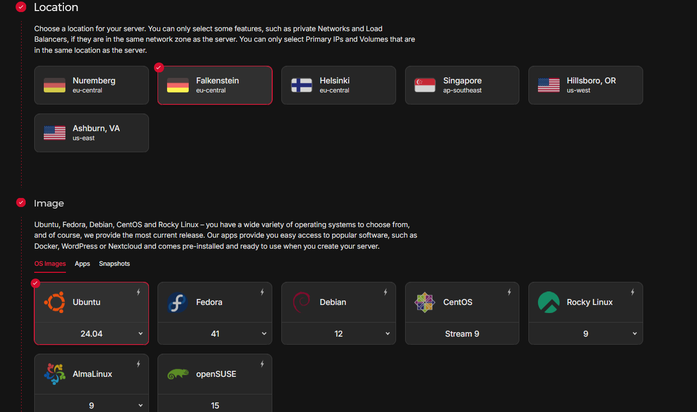
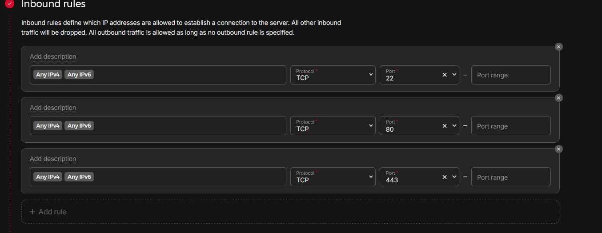

Wouldn’t it be pretty cool to self-host handy services like Google Photos, Dropbox, or even a VPN?  
Do you want full control over your data?
<!--more-->

A few years ago, I turned my back on the big cloud providers and have been managing the deployment of such services myself ever since. For me, it’s mainly about data sovereignty – my data is my data, and I don’t want to “pay” for services with my information.

Google and the like do offer free services, but they’re not really free – you pay with your (meta)data. I want to avoid that kind of “payment.” Instead, I handle the necessary infrastructure myself.

There are many open-source projects that not only replace commercial services 1:1 but often outperform them. In this article, I want to give you a foundation to get started with self-hosting.

---

# 2. Hardware

You don’t need much to start self-hosting. Initially, all you need is a PC or laptop. In a pinch, a tablet or smartphone could work too, but I’ll leave those out here.

This PC or laptop will later act as the control center for your server, since the server itself will be run headless.

**What does headless mean?**

> A headless server runs without a connected monitor, mouse, or keyboard. It is usually managed remotely over a network.

At the start, it doesn’t matter much whether your OS is Linux, macOS, or Windows. Personally, I recommend Linux as your main OS – it’s reliable, flexible, and perfect for self-hosting.  

**Server at home or in the cloud?**

Now the question arises: do you want to run your server at home or in the cloud?

**At home:**

A Raspberry Pi or a small mini-PC is a good choice. Mini-PCs in particular are an affordable solution. Many companies sell refurbished lease returns, which are perfect for beginners.

**In the cloud:**

If you don’t have space at home or don’t want to manage hardware yourself, you can rent a small cloud server for around €5/month.

Personally, I’ve had good experiences with Hetzner and Netcup – this isn’t an ad, just my recommendation based on personal use.

---

# 3. Software

Once the hardware is sorted, it’s time for software.

Short version: I’ve been using Ubuntu Server for years and am extremely happy with it. I recommend starting with it as well.

[Ubuntu Server iso](https://ubuntu.com/download/server)

---

# 4. Server Setup

For starters, I’ll explain the cloud setup with Hetzner, as it’s simpler and requires less effort. A separate article about setting up a home server in a homelab will follow later.

The cloud option is ideal for testing: you can spin up a server, try out different services, and cancel it if needed. No financial risk – starting costs are only about €5/month.

---

## 4.1 Setting Up the Server

Create an account:  
Sign up with Hetzner and log in at [Hetzner](https://www.hetzner.com/cloud/).

**Create a cloud server:**

* Choose a location (data center).  
* Select an operating system (I recommend Ubuntu).  
* Pick the smallest server:  
  * 2 vCPUs  
  * 4 GB RAM  

  
  

This is more than enough to get started.

---

## 4.2 Creating an SSH Key

To securely access your server, you need an SSH key. If you don’t have one, here’s how to create it:

**SSH Key Creation (Windows and Linux)**

Open a terminal (PowerShell on Windows or WSL).
Run the following command:

```shell
ssh-keygen -t ed25519
```

Follow the prompts to generate the key.

The public key will be saved in `~/.ssh/id_ed25519.pub` (Linux/Mac) or the corresponding directory on Windows.

Open the `id_ed25519.pub` file in a text editor, copy the content, and paste it in the Hetzner dashboard when creating the server.


Confirm the setup, and your server will be created. You can cancel anytime if you no longer need it.

---

## 4.3 Configuring Firewall Rules

Once in the Hetzner dashboard:

* Select your server.
* Set up a firewall: open ports 22, 80, and 443 (TCP).



**Port explanation:**

* Port 22: for SSH access to the server.
* Ports 80 and 443: for HTTP and HTTPS so your server can serve websites.

Now your server is secure and ready for the next configurations.

---

# 5. Docker and Docker Compose

You’ll need Docker and Docker Compose installed.
Don’t worry, it’s simple.

One-liner to install Docker:

```shell
curl -fsSL https://get.docker.com -o get-docker.sh
sudo sh ./get-docker.sh
```

If you get an error, it might be because `curl` is missing:

```shell
apt install curl
```

## 5.1 Testing Docker

Let’s test if Docker is installed correctly:

```shell
docker run hello-world
```

You should see something like this in your terminal:

```shell
test@ubuntu-server:~# docker run hello-world
Unable to find image 'hello-world:latest' locally
latest: Pulling from library/hello-world
c1ec31eb5944: Pull complete
Digest: sha256:5b3cc85e16e3058003c13b7821318369dad01dac3dbb877aac3c28182255c724
Status: Downloaded newer image for hello-world:latest

Hello from Docker!
This message shows that your installation appears to be working correctly.
```

---

# 6. DNS Setup

Our goal is to use Docker Compose to easily deploy web services or apps, e.g., under `cloud.2tap2.be` or `immich.2tap2.be`. For requests to resolve correctly, we need a reverse proxy. We’ll use Traefik, which we’ll install later.

First, set up your DNS records correctly. For example, with Cloudflare:

* Create an entry for `cloud` pointing to your server’s IP.
* Create a second entry for `immich` also pointing to your server’s IP.

This lets Traefik handle and route requests properly.

If you don’t want to create a separate DNS entry for each subdomain, you can also use a wildcard entry, e.g., `*.homelab`, pointing to your server’s IP. Then you can use any subdomain, like `yopass.homelab.2tap2.be`.

---

## 7. Useful Tools

A good development environment makes work much easier.
I recommend an IDE like Visual Studio Code or the open-source VSCodium.

[VSCodium](https://vscodium.com/)
[VSCode](https://code.visualstudio.com/)

Both are user-friendly and support numerous helpful plugins. Spending 30 minutes on YouTube to understand the basics is well worth it.



Join communities like r/selfhosted on Reddit or check out [awesome-selfhosted](https://github.com/awesome-selfhosted/awesome-selfhosted) on GitHub for more service recommendations.
